# Creating a Custom AXI4 Master in Vivado (Zedboard)

This tutorial shows you how to generate a custom AXI4 IP with burst functionality in Vivado and how to connect it to the HP Port of the Zynq PS on the Zedboard and simulate it with Vivado `xsim`.

## Requirements

- Vivado 2016.2
- Zedboard

## Creating a New Vivado Project

1. Start Vivado.
2. Choose "Create New Project" in the Vivado welcome menu.

    


3. Click _Next >_.

    


4. Choose a name for your project and a location. The project name in this tutorial is `axi4_master_burst_example`.

    


5. Choose _RTL Project_.

    


6. Don't add any HDL sources or netlists.

    


7. Don't add any existing IP components.

    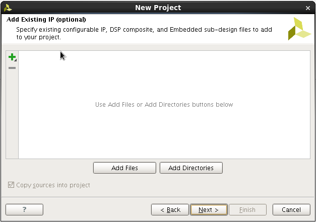


8. Don't add any constraints.

    


9. Choose _Boards_ and select _Zedboard Zynq Evaluation and Development Kit_.

    


10. Click "Finish" to create the Vivado project.

    


## Creating a Custom AXI IP

1. Open: _Menu -> Tools -> Create and Package IP_.


    


2. Click _Next >_.

    


3. Choose _Create a new AXI4 peripheral_.

    


4. Choose a name, description and location for the new AXI4 peripheral. The name in this tutorial is `axi4_master_burst` and the location is `[...]/ip_repo`.

    

5. Keep the AXI4-Lite Slave interface.

    


6. Click on the green plus sign to add another interface.

    


7. The added interface should be an AXI4-Full master interface.


    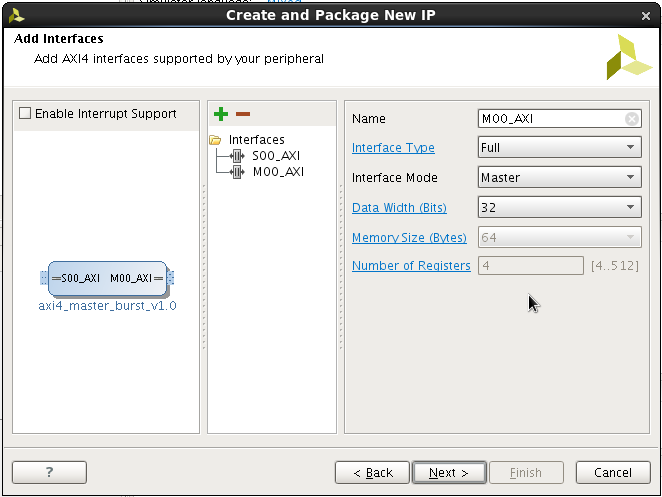


8. Choose _Edit IP_ and click on _Finish_.

    


## Edit Custom AXI4 IP

After the successful creation of the new IP a new Vivado project was opened. In this project you can find the Vivado generated Verilog code for the AXI4-Lite slave, AXI4-Full master, and a top module (wrapper) which contains those two components.


* `axi4_master_burst_v1_0` contains the top module.
* `axi4_master_burst_v1_0_S00_AXI_inst` contains the Verilog code for the AXI4-Lite slave.
* `axi4_master_burst_v1_0_M00_AXI_inst` contains the Verilog code for the AXI4-Full master.

The AXI4-Lite slave will be used to start and monitor a burst write/read of the AXI4-Full master from the Zynq PS. In order to do that you have to customize the AXI4-Lite slave a little. 

Double-click on `axi4_master_burst_v1_0_S00_AXI_inst` and navigate to the ports definition and add your own ports under `// Users to add ports here`.

```verilog 
// Users to add ports here
output wire init_txn,
input wire txn_done,
input wire txn_error,
// User ports ends
```

The output wire `init_txn` will later be connected to the AXI4-Full master to start a burst write/read. The input wires `txn_done` and `txn_error` will also be connected to the master and indicate if a write/read transaction was completed and if errors occured during a write/read transaction.

The output wire `init_txn` will be connected to the `slv_reg0` of the AXI4-Lite slave. Navigate to `// Add user logic here` and add the following:

```verilog
// Add user logic here
assign init_txn = slv_reg0[0:0];
// User logic ends
```

The input wires `txn_done` and `txn_error` are directly connected to the `slv_reg1` and `slv_reg2` registers of the AXI4-Lite slave. Navigate to `// Address decoding for reading registers` and change the code like this:

```verilog
// Implement memory mapped register select and read logic generation
// Slave register read enable is asserted when valid address is available
// and the slave is ready to accept the read address.
assign slv_reg_rden = axi_arready & S_AXI_ARVALID & ~axi_rvalid;
always @(*)
begin
    // Address decoding for reading registers
    case ( axi_araddr[ADDR_LSB+OPT_MEM_ADDR_BITS:ADDR_LSB] )
        2'h0   : reg_data_out <= slv_reg0;
        2'h1   : reg_data_out <= {{31{1'b0}},txn_done};
        2'h2   : reg_data_out <= {{31{1'b0}},txn_error};
        2'h3   : reg_data_out <= slv_reg3;
        default : reg_data_out <= 0;
    endcase
end
```

With those changes the Zynq PS is able to start a write/read transaction by setting the LSB of `slv_reg0` to `1` and is also able to read from the LSB of `slv_reg1` and `slv_reg2` to see if the write/read transaction was completed successfully.

The newly added ports of the AXI4-Lite slave also have to be added to the module instantiation in the top module `axi4_master_burst_v1_0`. Double click on `axi4_master_burst_v1_0` and navigate to `// Instantiation of Axi Bus Interface S00_AXI` and add the new ports to the port map:

```verilog
// Instantiation of Axi Bus Interface S00_AXI
axi4_master_burst_v1_0_S00_AXI # ( 
    .C_S_AXI_DATA_WIDTH(C_S00_AXI_DATA_WIDTH),
    .C_S_AXI_ADDR_WIDTH(C_S00_AXI_ADDR_WIDTH)
) axi4_master_burst_v1_0_S00_AXI_inst (

    .init_txn(m00_axi_init_axi_txn),
    .txn_done(m00_axi_txn_done),
    .txn_error(m00_axi_error),

```
Currently the wires `m00_*` are output or input ports of the top module. Those have to be removed from the interface and added as wire in the top module. To do that navigate in `axi4_master_burst_v1_0` to `// Ports of Axi Master Bus Interface M00_AXI` and **remove** the following lines:

```verilog
input wire m00_axi_init_axi_txn,
output wire m00_axi_txn_done,
output wire m00_axi_error,
```

Under the interface definition of the top module `axi4_master_burst_v1_0` add the following lines:

```verilog
wire m00_axi_init_axi_txn;
wire m00_axi_txn_done;
wire m00_axi_error;
```

Those `m00_*` wires are connecting the the AXI4-Full master and the AXI4-Lite slave in the top module. 

When you look at the verilog code of the AXI4-Full master in `axi4_master_burst_v1_0_M00_AXI_inst` you will see a lot of finite state machines which handle the AXI4 transactions. One of those finite state machine is responsible for the overall functionality of the AXI4-Full master. You can find this state machine when you navigate to `//implement master command interface state machine`. This state machine consists of four states:

* `IDLE`
* `INIT_WRITE`
* `INIT_READ`
* `INIT_COMPARE`

Initially the AXI4-Full master is in `IDLE` until the `init_txn_pulse` is set to high (this will be done by the AXI4-Lite slave `slv_reg0`). 

Then the AXI4-Full master will start to write `C_NO_BURSTS_REQ` bursts consisting of `C_M_AXI_BURST_LEN` data values to memory address `C_M_TARGET_SLAVE_BASE_ADDR`.

After the burst writes are completed the AXI4-Full master starts burst reads on the same memory addresses and compares the read values to the previously written values.

If the comparison was successful the master goes back into `IDLE` and waits for the next high signal on `init_txn_pulse`. To complete the changes in the verilog code do the following:

1. Click on the tab _Package IP - axi4\_master\_burst_.

    


2. Click on _Customization Parameters_ in _Packaging Steps_.

    


3. Click on _Merge changes from Customization Parameters Wizard_.

    


4. Click on _Review and Package_ in _Packaging Steps_.

    


5. To finish the work on your custom AXI4 IP click on _Re-Package IP_.

    


6. Quit the project by click on _Yes_.

    


You can go back to the Verilog code by clicking on _Flow Navigator -> Project Manager -> IP Catalog_.

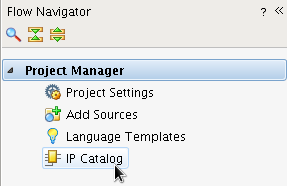

And navigate to _User Repository -> AXI Peripheral -> axi4\_master\_burst\_v1.0_ and right-click to open the context menu an choose _Edit in IP Packager_.


## Zynq Block Diagram

That your custom AXI4 IP can be implemented on the Zynq PL and connected to the Zynq PS you have to create a block diagram in Vivado. The following steps will show you how to do that:

1. Click on _Flow Navigator -> IP Integrator -> Create Block Diagram_.

    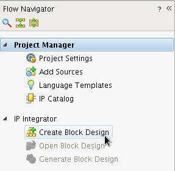


2. Choose a name, directory, and specify a source set for the block diagram. In this tutorial everything stays at the default.

    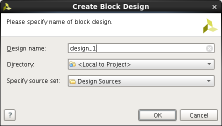


3. Right-click on the white background of the _Diagram_ tab and choose _Add IP_.

    


4. From the list of IPs choose _ZYNQ7 Processing System_ (this is the Zynq PS) and double-click on it. 

    


5. You can now see the Zynq PS in the block diagram. Click on _Run Block Automation_ to connect the Zynq PS with the memory.

    


6. Leave everything at the default values and click on _OK_.

    


7. To connect the your custom AXI4 IP to the Zynq PS the Zynq PS needs an AXI4-Full slave high performance port. To enable this port double-click on the Zynq PS in the block diagram.

    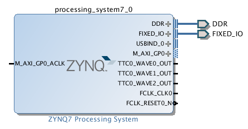


8. In the _Re-customize IP_ window go to _Page Navigator -> PS-PL Configuration_.

    


9. Go to _PS-PL Configuration -> HP Slave AXI Interface_ and check _S AXI HP0 interface_ and click on _OK_.

    


10. In the next step add your custom AXI4 IP by right-clicking on the white background and choosing _Add IP_. Choose _axi4\_master\_burst\_v1.0_ from the list of IPs and double-click on it.

    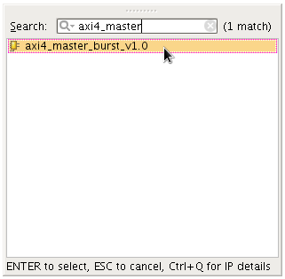


11. To connect the custom AXI4 IP on the Zynq PL to the Zynq PS click on _Run Connection Automation_.

    


12. In the _Run Connection Automation_ window click on _S00\_AXI_ and choose _/processing\_system7\_0/FCLK\_CLK0_ for _Clock Connection (...)_ and do the same with _S\_AXI\_HP0_.

    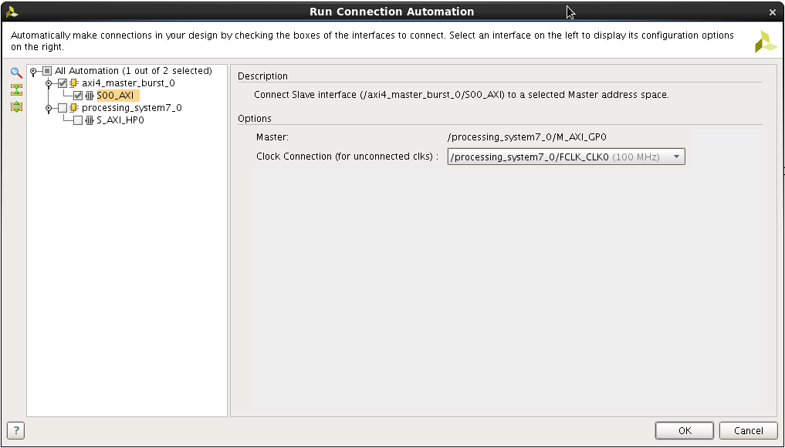


13. Check all checkboxes on the left-hand side of the _Run Connection Automation_ window to connect those ports automatically and click on _OK_.

    


14. After the auto connection is finished the block diagram should look like this:

    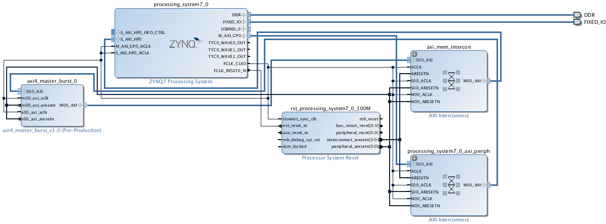


15. Click on the _Address Editor_ tab and unfold the _axi4\_master\_burst\_0_ tree to see the address range of the _S_AXI_HP0_ port which is connected to the memory. On the Zedboard the address range goes from `0x00000000` to `0x1FFFFFFF`.

    


16. In the _Diagram_ tab double-click on the _axi4\_master\_burst\_0_ to open the _Re-customize IP_ window. Set the _C M 00 AXI TARGET SLAVE BASE ADDR_ to ` 0x10000000` (The default value `0x40000000` is not within the range of the memory).

    


17. In the _Sources_ panel navigate to _Design Sources -> design\_1_.

    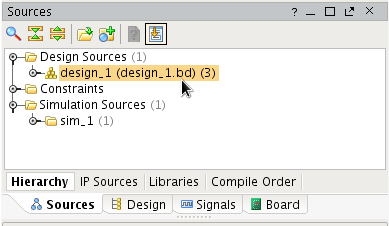


18. Right-click on _design\_1_ and choose _Create HDL Wrapper_. This generates HDL code for the block diagram which is necessary for the synthesis.

    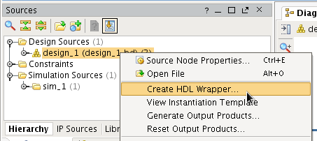


19. Choose _Let Vivado manage wrapper and auto-update_ and click _OK_. This will always update your HDL wrapper when the block diagram was changed.

    


20. After the HDL wrapper for block diagram was generated Vivado will ask if output products should be created. Those output products are necessary for the synthesis and the implementation of your custom AXI4 IP and the block diagram for the Zynq PL. Click on _Generate_ to generate the output products.

    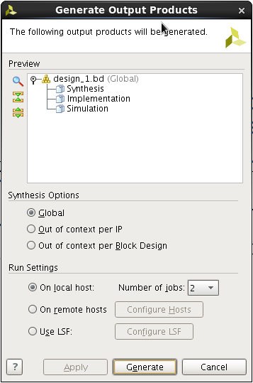


## Synthesis and Implementation

To bring the custom AXI4 IP with the block diagram to the Zynq PL you have to synthesize and implement it.

1. Start the synthesis by click on _Run Synthesis_ in _Flow Navigator -> Synthesis_.

    

2. After the synthesis is finished choose _Run implementation_ and click on _OK_ to run the implementation.

    

3. When the implementation is finished choose _Generate Bitstream_ and click on _OK_ to generate the bitstream which contains the configuration data for the Zynq PL. 

    

4. Lastly, when the bitstream generation is finished you can look at the reports to see if all contraints are fulfilled. Choose _View Reports_ and click _OK_. (However, this is not necessary here since the design is very simple).

    

## Software for the Zynq PS

To program the Zedboard and talk to it via UART you have to connect it to the power supply and connect two USB cables from your computer to the following USB ports on the Zedboard.

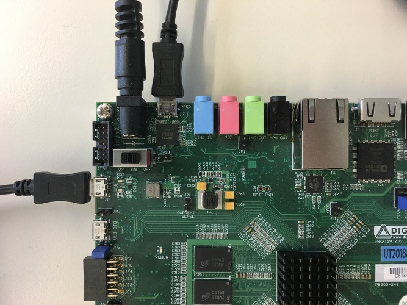

Make sure your Zedboard is turned on. If the green _POWER_ led is on the Zedboard is turned on.

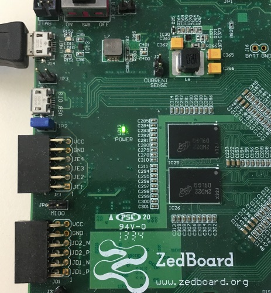

The C program which will be transferred to the Zynq PS will initiate an AXI4 read/write burst transaction over the AXI4-Lite slave interface of your custom AXI4 IP and afterwards it will verify the result.

1. You have to export the hardware configuration to the Xilinx SDK. Go to _Menu -> File -> Export -> Export Hardware ..._.

    


2. Check _Include bitstream_ and click _OK_.

    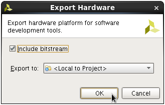


3. To launch the Xilinx SDK go to _Menu -> File -> Launch SDK_.

    


4. When the Xilinx SDK is ready create a new project by going to _Menu -> File -> New -> Application Project_.

    


5. Choose a _Project name_ and leave all other parameters at their default value and click on _Next >_. The _Project name_ in this tutorial is _axi4\_master\_burst\_test_. 

    


6. Choose _Hello World_ under _Available Templates_ and click on finish. This creates a simple Hello World program for the Zynq PS.

    


7. After the project was successfully created open `helloworld.c` under _Project Explorer -> axi4\_master\_burst\_test -> src -> helloworld.c_ .

    


8. Replace the Hello World C code with:

```c
#include "platform.h"
#include "xil_printf.h"
#include "xbasic_types.h"
#include "xparameters.h"

int main() {

    init_platform();

    xil_printf("== burst test== \n\r");

    // pointer to address the AXI4-Lite slave
    volatile Xuint32 *slaveaddr_p = (Xuint32 *) XPAR_AXI4_MASTER_BURST_0_S00_AXI_BASEADDR;

    // pointer to memory address 0x10000000
    volatile Xuint32 *data_p = (Xuint32 *) 0x10000000;

    // check status
    xil_printf("INIT_TXN\t0x%08x\n\r", *(slaveaddr_p+0));
    xil_printf("TXN_DONE\t0x%08x\n\r", *(slaveaddr_p+1));
    xil_printf("ERROR\t\t0x%08x\n\r", *(slaveaddr_p+2));
    xil_printf("\n\r");

    // start AXI4 write/read burst transaction
    *(slaveaddr_p+0) = 0x00000001;
    *(slaveaddr_p+0) = 0x00000000;

    // check status
    xil_printf("INIT_TXN\t0x%08x\n\r", *(slaveaddr_p+0));
    xil_printf("TXN_DONE\t0x%08x\n\r", *(slaveaddr_p+1));
    xil_printf("ERROR\t\t0x%08x\n\r", *(slaveaddr_p+2));
    xil_printf("\n\r");

    // print memory content
    int i;
    for(i = 0; i < 16; i++) {
        xil_printf("DATA+%d\t\t0x%08x\n\r", i, *(data_p+i));
    }

    cleanup_platform();
    return 0;
}
```


9. Program the Zynq PL with the previously generated bitstream by going to _Menu -> Xilinx Tools -> Program FPGA_.

    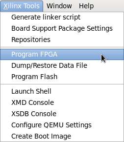


10. Click on _Program_.

    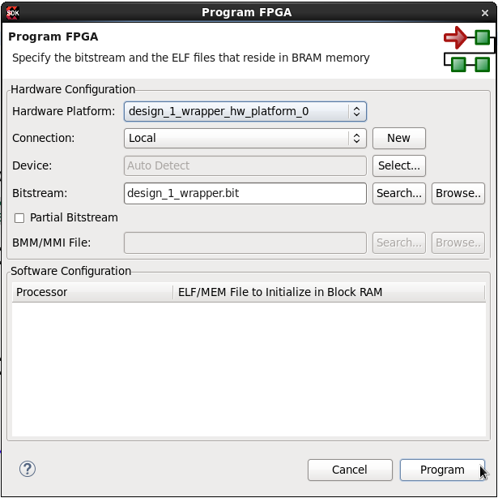


11. The Zynq PS will write the content of all `xil_printf("...");` statments to the UART.
    
    On Linux you can connect to the UART of the Zedboard with the following `picocom` command:
```bash
picocom /dev/ttyACM0 -b 115200 -d 8 -y n -p 1
```

12. After you programed the Zynq PL you and connected it to the UART you can run the Program on the Zynq PS by clicking on the green button with the white triangle.

    


13. Choose _Lauch on Hardware (System Debugger)_ and click on _OK_.

    


14. You should see the following output in `picocom`:

```
== burst test== 
INIT_TXN	0x00000000
TXN_DONE	0x00000000
ERROR		0x00000000

INIT_TXN	0x00000000
TXN_DONE	0x00000001
ERROR		0x00000000

DATA+0		0x00000001
DATA+1		0x00000002
DATA+2		0x00000003
DATA+3		0x00000004
DATA+4		0x00000005
DATA+5		0x00000006
DATA+6		0x00000007
DATA+7		0x00000008
DATA+8		0x00000009
DATA+9		0x0000000A
DATA+10		0x0000000B
DATA+11		0x0000000C
DATA+12		0x0000000D
DATA+13		0x0000000E
DATA+14		0x0000000F
DATA+15		0x00000010
```

You can leave `picocom` with [CTRL]+[A] [CTRL]+[Q].
    
## AXI4 IP Simulation

If you would like to simulate your custom IP before synthesizing it you can either use the bus functional model for the AXI4-Bus provided by Xilinx if you have the licences or you can write you own testbench and simulate with Vivado `xsim`. This tutorial provides a simple testbench for your previously generated custom AXI4 IP.

1. Go to the location of the Verilog files of you custom AXI4 IP. You find those in `[...]/ip_repo/ip_repo/axi4_master_burst_1.0/hdl`. 

2. Copy the testbench file from this tutorial [`hdl/axi4_master_burst_v1_0_tb.sv`](./hdl/axi4_master_burst_v1_0_tb.sv) into the HDL directory `[...]/ip_repo/ip_repo/axi4_master_burst_1.0/hdl`. The test bench initiates a burst write/read transaction by writing to `slv_reg0` and simulates a memory module for the burst write/read transactions.

3. Navigate with the command line to the HDL directory `[...]/ip_repo/ip_repo/axi4_master_burst_1.0/hdl` and execute the following commands: 
    ```bash
    xvlog axi4_master_burst_v1_0_M00_AXI.v
    xvlog axi4_master_burst_v1_0_S00_AXI.v
    xvlog axi4_master_burst_v1_0.v
    xvlog -sv axi4_master_burst_v1_0_tb.sv
    xelab -debug typical axi4_master_burst_v1_0_tb -s tb
    xsim --gui tb
    ```

    This opens the Vivado `xsim` simulator.

    


4. Select all signals in the _Objects_ section and right-click on them and choose _Add To Wave Window_.

    


5. Go into the _Tcl Console_ and type `run 40000ns` and press [Enter] to start the simulation. In the _Wave Window_ you will see all the signals of your custom AXI4 IP and their change over time. In the _Tcl Console_ is a log of the testbench which tells you about all burst write/read transactions and all the slave write/read transactions. In the end the testbench prints the content of the memory.
