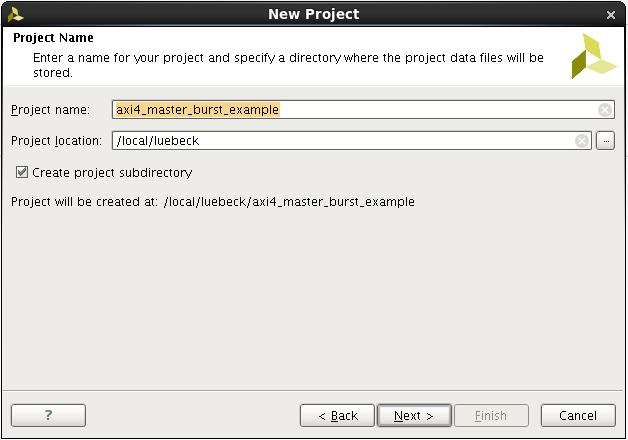
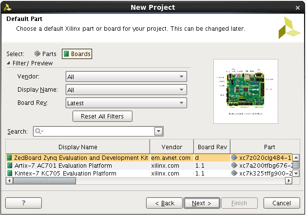
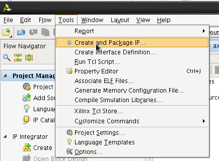
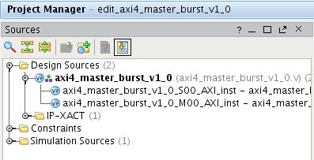
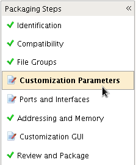
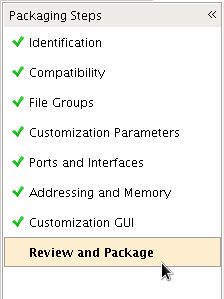

# Creating a Custom AXI4 Master in Vivado (Zedboard)

This tutorial shows how to generate a custom AXI4 Master with burst functionality in Vivado and how to connect it to the HP Port of the Zynq PS on the Zedboard. 

## Requirements

- Vivado 2016.2
- Zedboard

## Creating a New Vivado Project

1. Start Vivado.
2. Choose "Create New Project" in the Vivado welcome menu.

    


3. Click _Next >_.

    


4. Choose a name for your project and a location. The project name in this tutorial is `axi4_master_burst_example`.

    


5. Choose _RTL Project_.

    


6. Don't add any HDL sources or netlists.

    


7. Don't add any existing IP components.

    


8. Don't add any constraints.

    


9. Choose _Boards_ and select _Zedboard Zynq Evaluation and Development Kit_.

    


10. Click "Finish" to create the Vivado project.

    


## Creating a Custom AXI IP

1. Open: _Menu -> Tools -> Create and Package IP_.


    


2. Click _Next >_.

    


3. Choose _Create a new AXI4 peripheral_.

    


4. Choose a name, description and location for the new AXI4 peripheral. The name in this tutorial is `axi4_master_burst` and the location is [...]/ip_repo.

    

5. Keep the AXI4-Lite Slave interface.

    


6. Click on the green plus sign to add another interface.

    


7. The added interface should be an AXI4-Full Master interface.


    


8. Choose _Edit IP_ and click on _Finish_

    


## Edit AXI4 IP

After the successful creation of the new IP a new Vivado project was opened. In this project we can find the Vivado generated Verilog code for the AXI4-Lite slave, AXI4-Full master, and a wrapper which contains those two components.



* `axi4_master_burst_v1_0` contains the wrapper.
* `axi4_master_burst_v1_0_S00_AXI_inst` contains the Verilog code for the AXI4-Lite slave.
* `axi4_master_burst_v1_0_M00_AXI_inst` contains the Verilog code for the AXI4-Full master.

The AXI4-Lite slave will be used to start and monitor a burst write/read of the AXI4-Full master from the Zynq PS. In order to do that you have to customize the AXI4-Lite slave a little. 

Double click on `axi4_master_burst_v1_0_S00_AXI_inst` and navigate to the ports definition and add your own ports under `// Users to add ports here`

```verilog 
// Users to add ports here
output wire init_txn,
input wire txn_done,
input wire txn_error,
// User ports ends
```

The output wire `init_txn` will later be connected to the AXI4-Full master to start a burst write/read. The input wires `txn_done` and `txn_error` will also be connected to the master and indicate if a write/read transaction was completed and if errors occured during a write/read transaction.

The output wire `init_txn` will be connected to the `slv_reg0` of the AXI4-Lite slave. Navigate to `// Add user logic here` and add the following:

```verilog
// Add user logic here
assign init_txn = slv_reg0[0:0];
// User logic ends
```

The input wires `txn_done` and `txn_error` are directly connected to the `slv_reg1` and `slv_reg2` registers of the AXI4-Lite slave. Navigate to `// Address decoding for reading registers` and change the code like this:

```verilog
// Implement memory mapped register select and read logic generation
// Slave register read enable is asserted when valid address is available
// and the slave is ready to accept the read address.
assign slv_reg_rden = axi_arready & S_AXI_ARVALID & ~axi_rvalid;
always @(*)
begin
    // Address decoding for reading registers
    case ( axi_araddr[ADDR_LSB+OPT_MEM_ADDR_BITS:ADDR_LSB] )
        2'h0   : reg_data_out <= slv_reg0;
        2'h1   : reg_data_out <= {{31{1'b0}},txn_done};
        2'h2   : reg_data_out <= {{31{1'b0}},txn_error};
        2'h3   : reg_data_out <= slv_reg3;
        default : reg_data_out <= 0;
    endcase
end
```

With those changes the Zynq PS is able to start a write/read transaction by setting the LSB of `slv_reg0` to 1 and is also able to read from the LSB of `slv_reg1` and `slv_reg2` to see if the write/read transaction was completed successfully.

The newly added ports of the AXI4-Lite slave also have to be added to the wrapper `axi4_master_burst_v1_0`. Double click on `axi4_master_burst_v1_0` and navigate to `// Instantiation of Axi Bus Interface S00_AXI` and add the ports to the port map:

```verilog
// Instantiation of Axi Bus Interface S00_AXI
axi4_master_burst_v1_0_S00_AXI # ( 
    .C_S_AXI_DATA_WIDTH(C_S00_AXI_DATA_WIDTH),
    .C_S_AXI_ADDR_WIDTH(C_S00_AXI_ADDR_WIDTH)
) axi4_master_burst_v1_0_S00_AXI_inst (

    .init_txn(m00_axi_init_axi_txn),
    .txn_done(m00_axi_txn_done),
    .txn_error(m00_axi_error),

```

The `m00_*` wires are comming from the AXI4-Full master. When you look at the verilog code of the AXI4-Full master you will see a lot of finite state machines which handle the AXI4 transactions. One finite state machine is responsible for the overall functionality of the AXI4-Full master. You can find this state machine when you navigate to `//implement master command interface state machine`. This state machine consists of four states:

* `IDLE`
* `INIT_WRITE`
* `INIT_READ`
* `INIT_COMPARE`

Initially the AXI4-Full master is in `IDLE` until the `init_txn_pulse` is set to high (this will be done by the AXI4-Lite slave `slv_reg0`). 

Then the AXI4-Full master will start to write `C_NO_BURSTS_REQ` bursts consisting of `C_M_AXI_BURST_LEN` data values to memory address `C_M_TARGET_SLAVE_BASE_ADDR`.

After the burst writes are completed the AXI4-Full master starts burst reads on the same memory addresses and compares the read values to the previously written values.

If the comparison was successful the master goes back into `IDLE` and waits for the next high signal on `init_txn_pulse`. To complete the changes in the verilog code do the following:

1. Click on the tab _Package IP - axi4\\_master\\_burst_.

    


2. Click on _Customization Parameters_ in _Packaging Steps_.

    


3. Click on _Merge changes from Customization Parameters Wizard_.

    


4. Click on _Review and Package_ in _Packaging Steps_.

    


5. To finish the work on this custom AXI4 IP click on _Re-Package IP_

    


6. Quit the project by click on _Yes_.

    


## Zynq Block Diagram

## AXI4-Full Master Simulation
