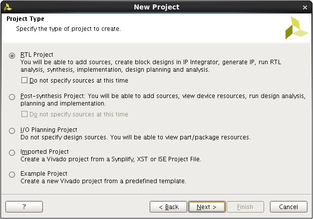

# Creating a Custom AXI4 Master in Vivado (Zedboard)

This tutorial shows how to generate a custom AXI4 Master with burst functionality in Vivado and how to connect it to the HP Port of the Zynq PS on the Zedboard. 

## Requirements

- Vivado 2016.2
- Zedboard

## Creating a New Vivado Project

1. Start Vivado.
2. Choose "Create New Project" in the Vivado welcome menu.

    

3. Click "Next >".

    

4. Choose a name for your project and a location. The project name in this tutorial is `axi4_master_burst_example`.

    

5. Choose "RTL Project".

    

6. Don't add any HDL sources or netlists.

    

7. Don't add any existing IP components.

    

8. Don't add any constraints.

    

9. Choose "Boards" and select "Zedboard Zynq Evaluation and Development Kit"

    

10. Click "Finish" to create the Vivado project.

    
